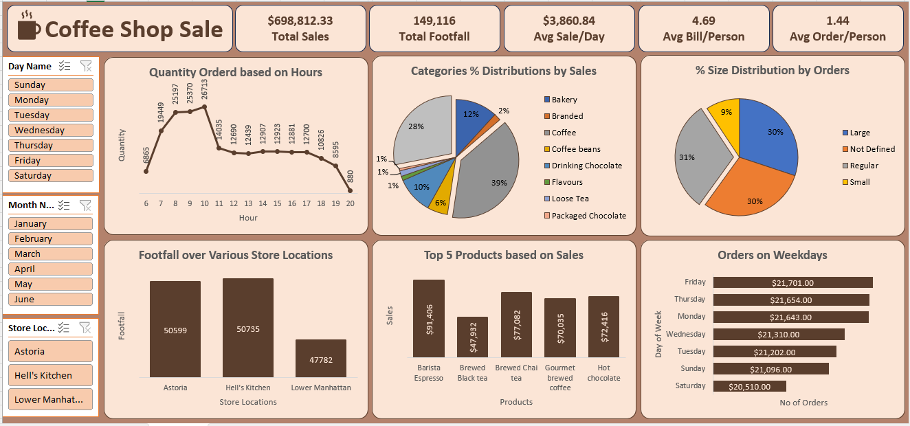

# ☕ Coffee Shop Sales Analysis Dashboard

## 📷 Dashboard Visualization

---

## 📌 Overview
This project analyzes coffee shop sales data to understand customer behavior, product performance, and revenue trends. The goal is to transform raw transaction data into actionable insights through an interactive Excel dashboard.

---

## 🎯 Business Objective
- Analyze sales performance across days, hours, and months  
- Identify peak sales periods and customer behavior patterns  
- Evaluate top-performing products and categories  
- Compare performance across store locations  
- Support data-driven decision-making  

---

## 🛠 Tools Used
- Microsoft Excel  
- Data Cleaning & Transformation  
- Pivot Tables  
- Data Visualization  

---

## 📊 Key Metrics
- **Total Sales:** $698,812.33  
- **Total Footfall:** 149,116  
- **Average Sales per Day:** $3,860.84  
- **Average Bill per Person:** 4.69  
- **Average Orders per Person:** 1.44  

---

## 📈 Dashboard Features
- Sales analysis by day and hour  
- Category-wise sales distribution  
- Store-wise footfall comparison  
- Top 5 products by revenue  
- Order distribution by size and weekdays  
- Interactive filters (Day, Month, Location)  

---

## 🔍 Key Insights
- Peak sales occur between **8 AM – 10 AM**, with **10 AM as the highest**  
- **Monday and Friday** have the highest sales; **Saturday is the lowest**  
- Sales increase over time, with **June being the highest revenue month**  
- **Hell’s Kitchen** store performs slightly better than others  
- Average customer spend is **~4.69**, indicating small frequent purchases  
- **Coffee is the top-selling category**, followed by Tea and Bakery  
- **Barista Espresso** is the highest revenue-generating product  
- Sales are mainly driven by **morning demand and beverage items**  

---

## 📁 Project Files
- `coffee_shop_sales_db.xlsx` → Dashboard File  
- `coffee_shop_sales_data.xlsx` → Raw dataset  
- `coffee_shop_sales_db_ss.PNG` → Dashboard screenshot  
- `coffee_shop_sales_insights.docx` → Insights document  

---

## ✅ Conclusion
This project highlights how data analysis and visualization can help uncover key business insights. The dashboard simplifies complex data into an easy-to-understand format, enabling better decision-making.
